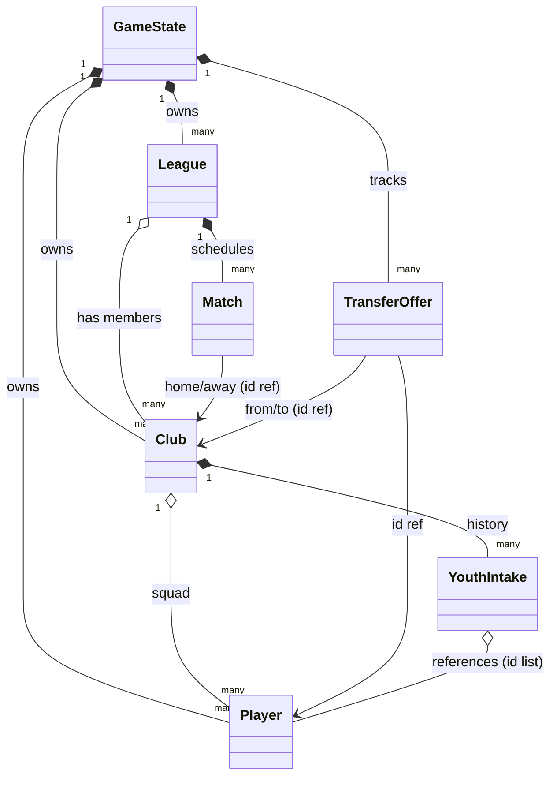

# Class Diagram

도메인 모델의 전체 구조. 자세한 결정 이유는 `design-decisions.md` 참조.

## Layer Overview

```
┌────────────────────────────────────────────────┐
│  Presentation Layer (UI, Scenes)               │
├────────────────────────────────────────────────┤
│  Application Layer (Systems, Stateless)        │
│    MatchSimulator, TransferSystem,             │
│    YouthSystem, SaveSystem,                    │
│    PlayerGenerator, ClubGenerator              │
├────────────────────────────────────────────────┤
│  Core Layer (Infra, 진입점/컨테이너)            │
│    GameManager, GameTime, EventBus, GameLog    │
├────────────────────────────────────────────────┤
│  Domain Layer (Game state, instances)          │
│    GameState, Player, Club, League             │
│    Match, TransferOffer, YouthIntake           │
│    GameDatabase                                │
├────────────────────────────────────────────────┤
│  Data Layer (Persistence, SO)                  │
│    JSON files, ScriptableObjects               │
└────────────────────────────────────────────────┘
```

> **의존 방향**: Domain 가장 안쪽 (외부 의존 0). Core → Domain. Application → Core + Domain. Presentation → Application + Core. `GameManager` 가 Core 인 이유는 `design-decisions.md` #29.

## Domain Layer Classes

### GameState (Root)

세이브 파일은 결국 이것 하나의 직렬화 결과.

```csharp
[Serializable]
public class GameState {
    // 게임 메타
    public DateTime currentDate;
    public int userClubId;
    public int rerollTokens;
    public int randomSeed;
    
    // 마스터 리스트
    public List<Player> allPlayers;
    public List<Club> allClubs;
    public List<League> leagues;
    public List<TransferOffer> activeOffers;
    
    // 런타임 인덱스 (직렬화 제외)
    [JsonIgnore] private Dictionary<int, Player> _playerById;
    [JsonIgnore] private Dictionary<int, Club> _clubById;
    
    public void BuildIndexes() { ... }
    public Player GetPlayer(int id) { ... }
    public Club GetClub(int id) { ... }
}
```

### Player

```csharp
[Serializable]
public class Player {
    public int id;
    public PersonalInfo info;
    public Stats stats;
    public int currentAbility;
    public int potentialAbility;
    public List<int> traitIds;
    
    public int currentClubId;
    public int youthClubId;     // 유스 데뷔 구단 (-1 = 외부)
    public PlayerOrigin origin; // InitialRoster / YouthIntake / Regen
    
    public Contract contract;
    public PlayerState state;
    public List<SeasonStat> career;
    public int faceSeed;
}
```

### Club

```csharp
[Serializable]
public class Club {
    public int id;
    public string name;
    public int foundedYear;
    public int leagueId;
    
    public Finance finance;
    public int reputation;
    public Facilities facilities;
    
    public List<int> seniorSquadIds;
    public List<int> youthSquadIds;
    public List<YouthIntake> intakeHistory;
    
    public SeasonState season;
    public bool isActiveSimulation;
}
```

### League

```csharp
[Serializable]
public class League {
    public int id;
    public int configSOId;  // LeagueConfigSO 참조
    public int seasonYear;
    public List<int> clubIds;
    public List<Match> schedule;
    public Standings standings;
}
```

### Match

```csharp
[Serializable]
public class Match {
    public int id;
    public DateTime date;
    public CompetitionType type;
    public int homeClubId;
    public int awayClubId;
    public MatchResult result;
    public List<MatchEvent> events;
}
```

### TransferOffer

```csharp
[Serializable]
public class TransferOffer {
    public int id;
    public int playerId;
    public int fromClubId;
    public int toClubId;
    public int amount;
    public Contract proposed;
    public OfferStatus status;
}
```

### YouthIntake

선수를 소유하지 않고 ID로만 참조 (Aggregation).

```csharp
[Serializable]
public class YouthIntake {
    public int id;
    public int clubId;
    public DateTime intakeDate;
    public List<int> candidatePlayerIds;
    public List<int> signedPlayerIds;
    public List<int> rejectedPlayerIds;
    public int rerollsUsed;
}
```

## Value Objects (Domain)

### Stats

```csharp
[Serializable]
public class Stats {
    public TechnicalStats technical;
    public MentalStats mental;
    public PhysicalStats physical;
    public GoalkeepingStats gk;
}

[Serializable]
public class TechnicalStats {
    public int passing;
    public int shooting;
    public int tackling;
    public int dribbling;
    public int heading;
    public int crossing;
    public int firstTouch;
    public int finishing;
    public int longShots;
    public int freeKickAccuracy;
    public int penaltyTaking;
    public int corners;
    
    public void ApplyToAll(Func<int, int> modifier) { ... }
}

[Serializable]
public class MentalStats {
    public int vision;
    public int anticipation;
    public int composure;
    public int concentration;
    public int decisions;
    public int determination;
    public int leadership;
    public int offTheBall;
    public int positioning;
    public int teamwork;
    public int workRate;
    public int aggression;

    public void ApplyToAll(Func<int, int> modifier) { ... }
}

[Serializable]
public class PhysicalStats {
    public int acceleration;
    public int agility;
    public int balance;
    public int jumping;
    public int naturalFitness;
    public int pace;
    public int stamina;
    public int strength;

    public void ApplyToAll(Func<int, int> modifier) { ... }
}

[Serializable]
public class GoalkeepingStats {
    public int aerialReach;
    public int commandOfArea;
    public int communication;
    public int eccentricity;
    public int handling;
    public int kicking;
    public int oneOnOnes;
    public int reflexes;
    public int rushingOut;
    public int throwing;

    public void ApplyToAll(Func<int, int> modifier) { ... }
}
```

### 기타 값 객체

```csharp
[Serializable]
public class PersonalInfo {
    public string firstName;
    public string lastName;
    public DateTime birthDate;
    public string nationalityCode;
    public Position primaryPosition;
    public List<Position> secondaryPositions;
    public Foot preferredFoot;
}

[Serializable]
public class Contract {
    public int weeklyWage;
    public DateTime startDate;
    public DateTime endDate;
    public int releaseClause;
}

[Serializable]
public class PlayerState {
    public int fatigue;
    public int morale;
    public int form;
    public InjuryInfo injury;
    public bool transferListed;
    public int seasonAppearances;
}

[Serializable]
public class Facilities {
    public int scoutLevel;
    public int trainingLevel;
    public int youthLevel;
}

[Serializable]
public class Finance {
    public int money;
    public int debt;
    public int transferBudget;
    public int wageBudget;
}

[Serializable]
public class InjuryInfo {
    public int injuryTypeId;
    public DateTime startDate;
    public DateTime expectedReturn;
    public bool isCareerThreatening;
}

[Serializable]
public class MatchResult {
    public int homeScore;
    public int awayScore;
    public List<int> homeStarting11;
    public List<int> awayStarting11;
    public List<PlayerMatchStat> playerStats;
}

[Serializable]
public class PlayerMatchStat {
    public int playerId;
    public int minutesPlayed;
    public int goals;
    public int assists;
    public float rating;
    public int yellowCards;
    public int redCards;
}

[Serializable]
public class Standings {
    public List<StandingEntry> entries;
}

[Serializable]
public class StandingEntry {
    public int clubId;
    public int played;
    public int won;
    public int drawn;
    public int lost;
    public int goalsFor;
    public int goalsAgainst;
    public int points;
}

[Serializable]
public class SeasonState {
    public int targetLeaguePosition;
    public CupTarget cupTarget;
    public int boardConfidence;
}

[Serializable]
public class SeasonStat {
    public int seasonYear;
    public int clubId;
    public int appearances;
    public int goals;
    public int assists;
    public float averageRating;
}
```

## Enums

```csharp
public enum PlayerOrigin {
    InitialRoster,
    YouthIntake,
    Regen
}

public enum Position {
    GK,
    CB, LB, RB, WB,
    DM, CM, AM, LM, RM,
    LW, RW, ST, CF
}

public enum Foot {
    Left,
    Right,
    Both
}

public enum CompetitionType {
    League,
    FACup,
    CarabaoCup
    // V0.1 외 추가 시 확장
}

public enum OfferStatus {
    Pending,
    Negotiating,
    Accepted,
    Rejected,
    Completed
}

public enum CupTarget {
    None,            // V0.1 기본 — 컵 미참여
    GroupStage,
    Round16,
    QuarterFinal,
    SemiFinal,
    Final,
    Win
    // V1.0+ 컵 시스템에서 본격 활용
}

public enum FacilityType {
    Scout,
    Training,
    Youth
}
```

## ScriptableObject Layer

게임 룰북. 빌드에 포함, 플레이 중 안 바뀜.

| SO | 용도 |
| --- | --- |
| `GameBalanceSO` | 모든 밸런싱 수치 외부화 |
| `TraitSO` | 트레잇 정의 (늦깎이형, 빅매치형 등) |
| `PositionSO` | 포지션 + 키 스탯 + 2차 affinity |
| `LeagueConfigSO` | 리그 규칙 (팀 수, 강등 수, 일정 패턴) |
| `FacilityLevelSO` | 시설 등급별 효과 |
| `TacticPresetSO` | 전술 프리셋 (V1.0~) |
| `InjuryTypeSO` | 부상 종류 |
| `CountrySO` | 국가 정보 (코드, 깃발색 등) |
| `NamePoolSO` | 이름 풀 (국가별) |

### TraitSO

```csharp
[CreateAssetMenu(fileName = "Trait", menuName = "FM-Lite/Trait")]
public class TraitSO : ScriptableObject {
    public int id;
    public string displayName;
    public string description;
    public float weight = 1.0f;          // PlayerGenerator 부여 확률 가중치
    public int exclusionGroupId = 0;     // design-decisions.md #25, 0 = 충돌 없음
}
```

### PositionSO

```csharp
[CreateAssetMenu(fileName = "Position", menuName = "FM-Lite/Position")]
public class PositionSO : ScriptableObject {
    public int id;
    public Position position;
    public string displayName;
    public bool isGoalkeeper;
    public bool emphasizesTechnical = true;
    public bool emphasizesMental = true;
    public bool emphasizesPhysical = true;

    // design-decisions.md #26
    public List<PositionAffinity> affinities = new List<PositionAffinity>();
    public float fallbackAffinityWeight = 0.05f;
}

[Serializable]
public class PositionAffinity {
    public Position position;
    public float weight;     // 1.0 ~ 10.0 권장 (fallback 0.05 대비)
}
```

## Core Layer (Infra)

진입점·인프라. 도메인 로직은 가지지 않고 Application 시스템에 위임 (`design-decisions.md` #29).

```csharp
// 최상위 매니저 (싱글톤). GameState 는 보유만 하고 변경은 시스템이 함.
public class GameManager : MonoBehaviour {
    public static GameManager Instance { get; private set; }
    public GameState State { get; private set; }
    public Club UserClub => State?.GetClub(State.userClubId);
    public void SetState(GameState state);
}

// 시간 진행
public static class GameTime {
    public static DateTime CurrentDate { get; private set; }
    public static void Reset(DateTime d);
    public static void Advance(int days);   // 하루씩 N번 DayAdvancedEvent 발행
}

// 이벤트 시스템 (정적)
public static class EventBus {
    public static void Publish<T>(T evt);
    public static void Subscribe<T>(Action<T> handler);
    public static void Unsubscribe<T>(Action<T> handler);
}
```

## Application Layer (Systems)

상태 없음. GameState를 입력받아 변경 (`design-decisions.md` #3).

```csharp
public class MatchSimulator {
    public MatchResult Simulate(Match match, GameState state);
}

public class TransferSystem {
    public void ProcessOffers(GameState state);
    public int CalculateMarketValue(Player p, GameState state);
}

public class YouthSystem {
    public YouthIntake GenerateIntake(Club club, GameState state);
    public void UseRerollToken(YouthIntake intake, GameState state);
}

public class SaveSystem {
    public void Save(GameState state, string slotName);
    public GameState Load(string slotName);
}
```

## Relationship Diagram (Mermaid)



## Save File Structure (Preview)

```json
{
  "currentDate": "2025-08-15T00:00:00",
  "userClubId": 1,
  "rerollTokens": 3,
  "randomSeed": 42,
  "allPlayers": [
    {
      "id": 1,
      "info": {
        "firstName": "John",
        "lastName": "Doe",
        "birthDate": "1999-05-12T00:00:00",
        "nationalityCode": "ENG",
        "primaryPosition": "ST",
        "preferredFoot": "Right"
      },
      "stats": {
        "technical": { "passing": 12, "shooting": 16, ... },
        "mental": { ... },
        "physical": { ... },
        "gk": { ... }
      },
      "currentAbility": 145,
      "potentialAbility": 165,
      "traitIds": [3, 7],
      "currentClubId": 1,
      "youthClubId": 12,
      "origin": "InitialRoster",
      "contract": { ... },
      "state": { ... },
      "career": [],
      "faceSeed": 12345
    }
  ],
  "allClubs": [ ... ],
  "leagues": [ ... ],
  "activeOffers": [ ... ]
}
```
